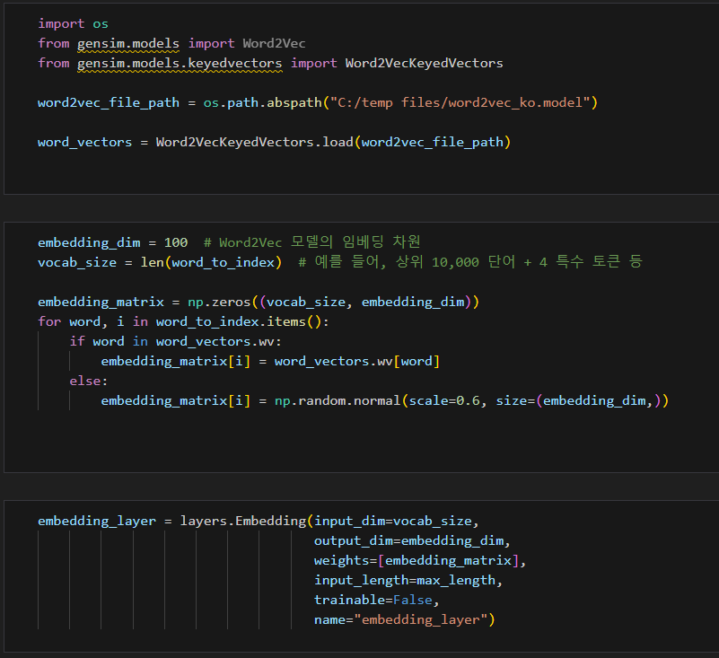
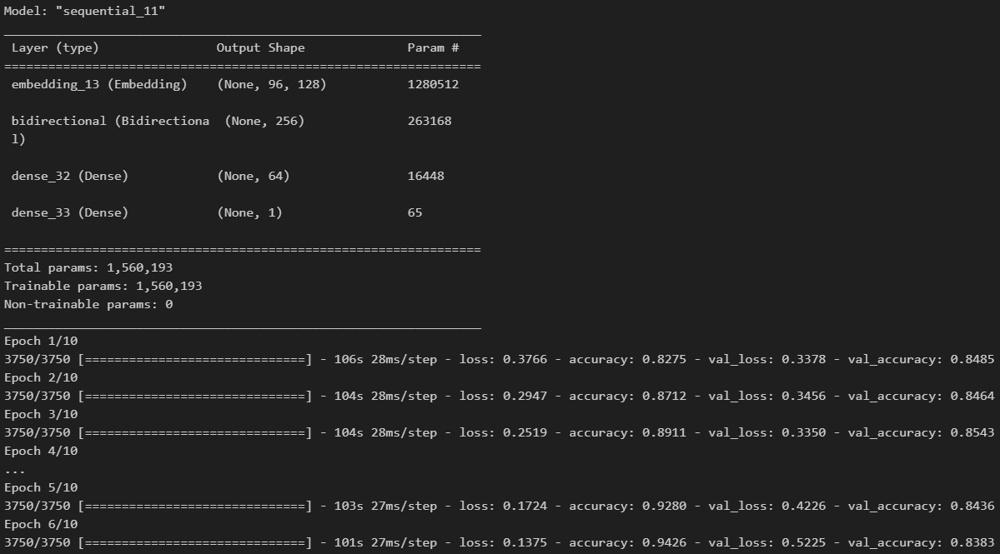
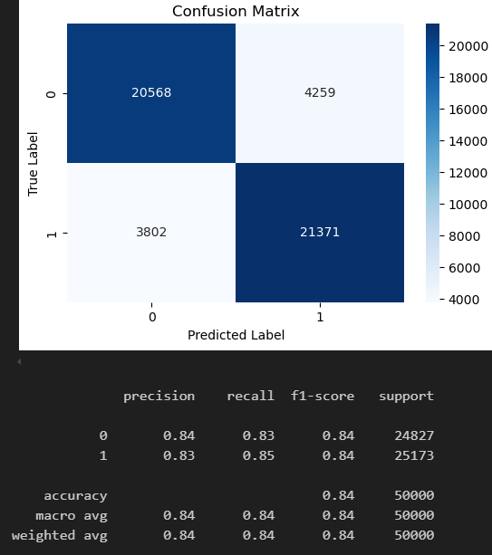
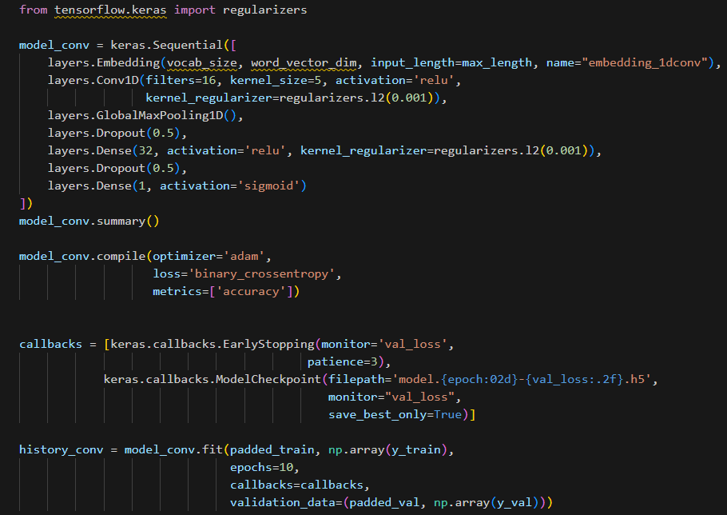

# AIFFEL Campus Online Code Peer Review Templete
- 코더 : 염철헌
- 리뷰어 : 김인수


# PRT(Peer Review Template)
- [X]  **1. 주어진 문제를 해결하는 완성된 코드가 제출되었나요?**
    - 문제에서 요구하는 최종 결과물이 첨부되었는지 확인
        - 중요! 해당 조건을 만족하는 부분을 캡쳐해 근거로 첨부  
        pretrained word vector을 이용한 실험, word embedding을 처음부터 모델과 함께 학습하는 실험들을 진행하였습니다(첨부).  
          
          

    
- [X]  **2. 전체 코드에서 가장 핵심적이거나 가장 복잡하고 이해하기 어려운 부분에 작성된 
주석 또는 doc string을 보고 해당 코드가 잘 이해되었나요?**
    - 해당 코드 블럭을 왜 핵심적이라고 생각하는지 확인
    - 해당 코드 블럭에 doc string/annotation이 달려 있는지 확인
    - 해당 코드의 기능, 존재 이유, 작동 원리 등을 기술했는지 확인
    - 주석을 보고 코드 이해가 잘 되었는지 확인  
        전반적으로 이해가 쉬운 코드를 사용하고 간결한 주석을 달고 있습니다.
        
- [X]  **3. 에러가 난 부분을 디버깅하여 문제를 해결한 기록을 남겼거나
새로운 시도 또는 추가 실험을 수행해봤나요?**
    다른 종류의 형태소분석기를 사용하고, 형태소 분석기 속도가 다름을(10분-몇초) 리뷰 과정에서 확인하였습니다.  
    각 실험 세팅별 모델의 상태를 진단하고 성능이 별로라면 이유를 판단,   
    단계적으로 해결책을 분석한 점이 좋았습니다.    
    - LSTM : 오히려 성능이 나쁜 부분 원인을 파악함(패딩)  
    - Conv : confusion matrix를 뽑아 보았을 때 false/true로 예측하는 부분을 확인함  
    - 1D conv : 1D conv 다양한 필터 활용 실험 및 규제로 ~0.83 성능을 얻음, 규제로 개선이 잘 되지 않음 확인함 등이었습니다.  
        

- [X]  **4. 회고를 잘 작성했나요?**
    코드 말미에 회고를 잘 작성하였습니다.

- [X]  **5. 코드가 간결하고 효율적인가요?**
    전반적으로 본인이 사용하는 모듈을 템플릿으로 만들었고, 중복이 적은 효율적인 코드를 사용하고 있습니다.  
    


# 회고(참고 링크 및 코드 개선)
```
# 리뷰어의 회고를 작성합니다.
# 코드 리뷰 시 참고한 링크가 있다면 링크와 간략한 설명을 첨부합니다.
# 코드 리뷰를 통해 개선한 코드가 있다면 코드와 간략한 설명을 첨부합니다.

실험 과정이 전반적으로 완성도 높게 수행되었습니다.
```
